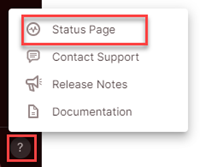

# Release notes

Firebolt continuously releases updates so that you can benefit from the latest and most stable service. These updates might happen daily, but we aggregate release notes to cover a longer time period for easier reference. The most recent release notes from the past 30 days are below. See the [Release notes archive](release-notes-archive.md) for earlier-version release notes.

{: .note}
Firebolt might roll out releases in phases. New features and changes may not yet be available to all accounts on the release date shown.

## May 31, 2022

* [New features](#new-features)
* [Enhancements, changes, and new integrations](#enhancements-changes-and-new-integrations)
* [Resolved issues](#resolved-issues)

### New features

*  You can now use the help menu to check the Firebolt service status page.  
  

* Added support for `CREATE AND GENERATE AGGREGATING INDEX IF NOT EXISTS`. For more information, see [CREATE AGGREGATING INDEX](../sql-reference/commands/create-aggregating-index.md).

* Added an information schema view for indexes. The view is available for each database and contains one row for each index. For more information, see [Information schema for indexes](../general-reference/information-schema/indexes.md).

* Added `ARRAY_AGG` as an alias of `NEST`. For more information, see [NEST](../sql-reference/functions-reference/nest.md).

* You can now concatenate strings, numbers, and arrays using the `||` operator without exlicitly casting elements.

* Added `TO_TEXT` as an alias of `TO_STRING`. For more information, see [TO_STRING](../sql-reference/functions-reference/to-string.md).

*  An improved approach to Window functions is available for Beta testing by request. For more information, contact Firebolt Support.

### Enhancements, changes, and new integrations

* Improved query execution on queries that read table data in Amazon S3. Firebolt now achieves greater read parallelization, which significantly speeds up queries that read many columns.

* **Cube.js integration**  
  You can now configure a Firebolt database as a data source for [Cube.js](https://cube.dev). Cube.js is an embedded BI platform that allows you to define a data model, manage security and multitenancy, accelerate queries, and expose data to your applications using SQL and APIs. For more information, see [Firebolt](https://cube.dev/docs/config/databases/firebolt) in Cube.js documentation.

* **Tableau connector**  
  An official Firebolt connector is now available in the [Tableau Exchange](https://exchange.tableau.com/products/650) so you can use Tableau more easily to analyze and visualize your Firebolt data.

* **Sifflet integration**  
  Firebolt now integrates with Sifflet to improve your visibility into data quality issues, data lineage, and data discovery. For more information, see [Firebolt](https://docs.siffletdata.com/docs/firebolt) in Sifflet documentation.

* **Looker symmetric aggregates**  
  Symmetric aggregates in Looker are now supported when connected to Firebolt. For more information, see [A Simple Explanation of Symmetric Aggregates](https://help.looker.com/hc/en-us/articles/360023722974) in the Looker Help Center.

* **dbt append-only incremental materializations**  
  The dbt-firebolt adapter now supports append-only incremental materializations. For more information, see [Firebolt configurations](https://docs.getdbt.com/reference/resource-configs/firebolt-configs) in dbt documentation.

### Resolved issues

* Fixed an issue that caused a `Type mismatch in joinGet` error when using a join index in table joins where columns are of different numeric types&mdash;for example, joining a column in a fact table defined as `DOUBLE` with a column defined as `BIGINT` in a dimension table.

* Fixed an issue that caused the `ARRAY_JOIN` function to fail with an array of numeric values.

* Fixed an issue in the `REGEXP_MATCHES` function that caused an error in some circumstances when a specified pattern didn't match the input string.

* Fixed an issue that caused a session to hang when trying to query an external table referencing an empty JSON file in Amazon S3.

* Fixed an issue that caused incorrect column names when using `COPY TO` with a `SELECT` statement that uses aliases.
